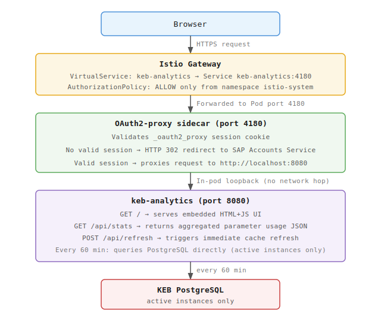
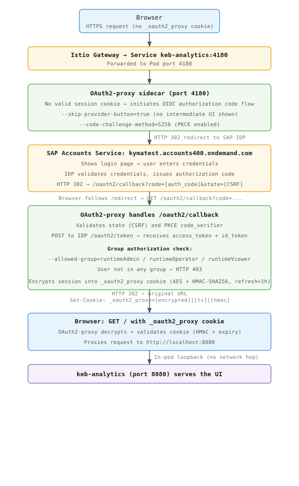

<!--{"metadata":{"publish":false}}-->

# KEB Parameter Usage Analytics

The `keb-analytics` binary provides a self-contained analytics UI that shows which provisioning and update parameters were used across all active Kyma instances.

## Architecture

`keb-analytics` is a separate Go binary deployed alongside KEB in the same Helm chart. It connects directly to the KEB PostgreSQL database, aggregates parameter usage statistics, and caches them in memory. It exposes a web UI and a JSON API protected by an OAuth2-proxy sidecar.



## Authentication

External access is protected by an OAuth2-proxy sidecar running in the same Pod as `keb-analytics`. All requests pass through the OAuth2-proxy on port 4180 before reaching the analytics application on port 8080.



The authentication flow uses the following configuration:

- Identity provider: SAP Accounts Service (`https://kymatest.accounts400.ondemand.com`)
- Protocol: OIDC with PKCE (S256)
- Access control: Group-based — only members of the `runtimeAdmin`, `runtimeOperator`, or `runtimeViewer` OIDC groups are allowed in
- Credentials: Managed via Vault Secret Operator (VSO); the `keb-analytics-oauth2-proxy` Kubernetes Secret is automatically synced from Vault path `ias` using the fields `keb_analytics_client_id`, `keb_analytics_client_secret`, and `keb_analytics_biscuit_secret`

The Istio `AuthorizationPolicy` restricts Pod ingress to the `istio-system` namespace only, and a network policy limits traffic to the Istio ingress gateway.

## Configuration

`keb-analytics` is configured using the following environment variables with the `APP_` prefix:

| Variable | Default | Description |
|---|---|---|
| **APP_DATABASE_HOST** | `localhost` | PostgreSQL host |
| **APP_DATABASE_PORT** | `5432` | PostgreSQL port |
| **APP_DATABASE_USER** | `postgres` | PostgreSQL user |
| **APP_DATABASE_PASSWORD** | `password` | PostgreSQL password |
| **APP_DATABASE_NAME** | `broker` | PostgreSQL database name |
| **APP_DATABASE_SSLMODE** | `disable` | PostgreSQL SSL mode |
| **APP_PORT** | `8080` | HTTP port for the analytics server |
| **APP_REFRESHINTERVAL** | `1h` | How often to refresh the in-memory stats cache |

## HTTP Endpoints

### `GET /`

Serves the embedded single-page analytics UI. Requires OIDC authentication using OAuth2-proxy.

### `GET /api/stats`

Returns a JSON object with aggregated parameter usage statistics.

**Query parameters:**

| Parameter | Format | Description |
|---|---|---|
| **from** | `YYYY-MM-DD` | Start of time range (filters by provisioning/update operation creation date) |
| **to** | `YYYY-MM-DD` | End of time range |
| **plan** | string | Filter by plan name (for example, `aws`, `azure`, `gcp`, `trial`) |
| **region** | string | Filter by provisioning region |

All parameters are optional. Omitting **from**/**to** returns stats for all active instances from the in-memory cache. Providing a time range triggers a live DB query.

**Response schema:**

```json
{
  "total_instances": 1234,
  "total_updates": 410,
  "provisioning": {
    "parameters": [
      { "parameter": "region",      "set_count": 1200, "total": 1234 },
      { "parameter": "machineType", "set_count":  950, "total": 1234 }
    ]
  },
  "updates": {
    "parameters": [
      { "parameter": "machineType", "set_count": 320, "total": 410 }
    ]
  },
  "combined": {
    "parameters": [
      { "parameter": "machineType", "set_count": 980, "total": 1234 }
    ]
  },
  "distributions": [
    {
      "parameter": "machineType",
      "values": { "m6i.xlarge": 410, "Standard_D4_v3": 280 }
    }
  ],
  "trends": [
    {
      "parameter": "machineType",
      "points": [
        { "date": "2025-01-01", "count": 10, "total": 50 },
        { "date": "2025-01-02", "count": 15, "total": 60 }
      ]
    }
  ],
  "adoption_trends": [ ],
  "plans": ["aws", "azure", "gcp", "trial"],
  "regions_by_plan": {
    "aws":   ["eu-central-1", "us-east-1"],
    "azure": ["westeurope", "eastus"]
  }
}
```

Field descriptions:

- **total_instances** — number of active instances (succeeded provision, not deprovisioned)
- **total_updates** — number of succeeded update operations on active instances
- **provisioning** — parameter usage ranked by how many instances had each parameter set at provisioning time
- **updates** — parameter usage across all update operations (one instance may contribute multiple times)
- **combined** — per-instance deduplication: an instance is counted once per parameter if it was set in provisioning *or* any update operation
- **distributions** — value breakdowns for all distribution-worthy parameters (all fields except those emitting numeric counts, such as **administrators** and **additionalWorkerNodePools**); sorted alphabetically
- **trends** / **adoption_trends** — daily cumulative counts of active instances with each parameter set; **count** is the running total of instances that have the parameter set on that day, **total** is the cumulative number of active instances provisioned by that day
- **set_count** is the number of instances/operations that had the parameter explicitly set; parameters are sorted by **set_count** descending

### `POST /api/refresh`

Triggers an immediate out-of-band refresh of the in-memory cache by re-querying the database. Returns `204 No Content`.

## Active Instance Definition

An instance is considered active if a row for it exists in the `instances` table with **deleted_at** equal to the zero timestamp. This means the following:

- Permanently deprovisioned instances (row deleted) are excluded
- Temporarily suspended instances (row exists, **deleted_at** zero) are included
- Instances with a failed deprovision that set **deleted_at** are excluded

## UI Views

The UI is a single-page application with four tabs:

| Tab | Description |
|---|---|
| **Provisioning** | Ranked bar chart of provisioning parameter usage; each bar shows **set_count** and percentage of active instances |
| **Update** | Parameter usage across update operations; shows total update operation count and per-parameter **set_count** |
| **Combined** | Per-instance deduplication across provisioning and updates; each instance counted once per parameter |
| **Value Distribution** | Bar chart of distinct values for a selected parameter (for example, **machineType** breakdown); covers all distribution-worthy fields |

Global filters (Period, Plan, Region) apply to all tabs.

## Local Development

Three Python scripts in `utils/` help populate a local KEB database with realistic test data. They all require KEB running locally (default: `http://localhost:8080`) and a port-forwarded PostgreSQL instance (default: `localhost:5432`).

### `seed_analytics.py` — Provision Instances Using KEB API

Provisions N instances through the KEB OSB API with varied parameters across plans and regions, then applies updates to ~40% of them. This is the primary script for populating a fresh local environment.

```bash
cd utils/

# Provision 1000 instances (default) and apply updates
python seed_analytics.py

# Provision 200 instances, skip updates
python seed_analytics.py --count 200 --skip-updates

# Simulate a parameter introduced 30 days ago (only ~33% of instances get it)
python seed_analytics.py --param-cutoff ingressFiltering:30
```

| Flag | Default | Description |
|---|---|---|
| `--count N` | `1000` | Number of instances to provision |
| `--seed N` | `42` | Random seed for reproducibility |
| `--skip-updates` | — | Skip the update phase |
| `--poll-timeout N` | `600` | Seconds to wait for operations to complete |
| `--backdate-days N` | `90` | Total time window used to compute `--param-cutoff` fractions |
| `--param-cutoff PARAM:DAYS_AGO` | — | Simulate a parameter introduced N days ago; can be repeated |

After seeding, run `backdate_operations.py` to spread **created_at** timestamps over a realistic time window so trend charts show meaningful data.

### `backdate_operations.py` — Spread Timestamps over a Past Time Window

Updates **created_at** on provisioning operations and their instances to random offsets within the past N days. This is required for the trend charts in the analytics UI to show historical data.

```bash
cd utils/

# Spread over the past 90 days (default), local k3d setup
python backdate_operations.py

# Custom DB connection
python backdate_operations.py --days 180 --db-password mypassword
```

| Flag | Default | Description |
|---|---|---|
| `--days N` | `90` | Spread timestamps over this many past days |
| `--db-host HOST` | `localhost` | PostgreSQL host |
| `--db-port PORT` | `5432` | PostgreSQL port |
| `--db-name NAME` | `postgresdb` | PostgreSQL database name |
| `--db-user USER` | `postgresadmin` | PostgreSQL user |
| `--db-password PWD` | `password` | PostgreSQL password |

### `seed_updates.py` — Send Updates to Existing Instances

Reads active instance IDs from the database and sends PATCH update requests using the KEB API to a fraction of them. Use this to add update operations on top of an already-provisioned dataset without re-seeding from scratch.

```bash
cd utils/

# Update 40% of active instances (default)
python seed_updates.py

# Update 20% with a custom DB password
python seed_updates.py --fraction 0.2 --db-password mypassword
```

| Flag | Default | Description |
|---|---|---|
| `--fraction F` | `0.4` | Fraction of active instances to update |
| `--seed N` | `42` | Random seed for reproducibility |
| `--db-host HOST` | `localhost` | PostgreSQL host |
| `--db-port PORT` | `5432` | PostgreSQL port |
| `--db-name NAME` | `postgresdb` | PostgreSQL database name |
| `--db-user USER` | `postgresadmin` | PostgreSQL user |
| `--db-password PWD` | `password` | PostgreSQL password |

### Typical Local Setup Sequence

```bash
# 1. Start local KEB (k3d cluster + port-forwards assumed to be running)
# 2. Seed instances and updates via KEB API
python utils/seed_analytics.py --count 500

# 3. Spread timestamps so trend charts have historical data
python utils/backdate_operations.py --days 90

# 4. Trigger a cache refresh in keb-analytics
curl -X POST http://localhost:8081/api/refresh
```
