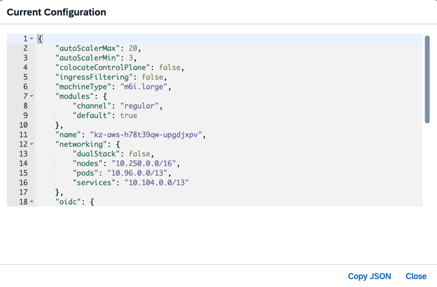
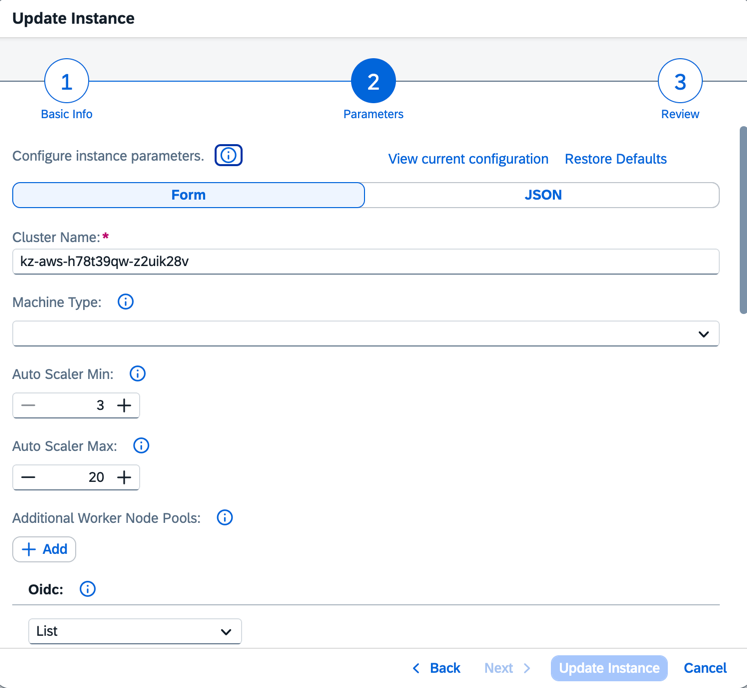
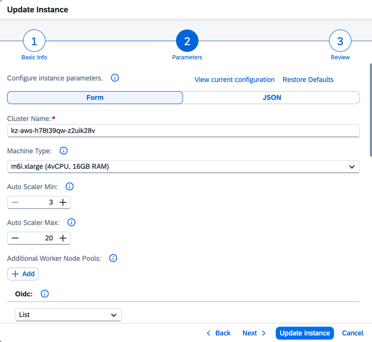

# Abstract Machines Names

## Status

Accepted

## Context

Machine types are currently exposed to users as concrete hyperscaler-specific instance names such as `m6i.large`, `Standard_D2s_v5`, or `n2-standard-2`.
This makes machine configuration tightly coupled to a specific provider family and generation.

That coupling causes the following problems:
- Introducing a newer machine generation requires schema changes,
- Previously accepted values must remain valid for backward compatibility,
- Removing old values breaks update flows in the BTP Cockpit and client-side validation in BTP CLI,
- Switching to a different machine family or generation is operationally expensive and hard to communicate to users.

To address this, machine names should be abstracted from concrete instance types while preserving backward compatibility for already supported values.

### Current Configuration

- AWS

  ```yaml
  providersConfiguration:
    aws:
      machines:
        m6i.large: m6i.large (2vCPU, 8GB RAM)
        m6i.16xlarge: m6i.16xlarge (64vCPU, 256GB RAM)
        m5.large: m5.large (2vCPU, 8GB RAM)
        m5.16xlarge: m5.16xlarge (64vCPU, 256GB RAM)
        c7i.large: c7i.large (2vCPU, 4GB RAM)
        c7i.16xlarge: c7i.16xlarge (64vCPU, 128GB RAM)
        g6.xlarge: g6.xlarge (1GPU, 4vCPU, 16GB RAM)*
        g6.16xlarge: g6.16xlarge (1GPU, 64vCPU, 256GB RAM)*
        g4dn.xlarge: g4dn.xlarge (1GPU, 4vCPU, 16GB RAM)*
        g4dn.16xlarge: g4dn.16xlarge (1GPU, 64vCPU, 256GB RAM)*
  
        # New memory-intensive machine types
        r8i.large: r8i.large (2vCPU, 16GB RAM)
        r8i.16xlarge: r8i.16xlarge (64vCPU, 512GB RAM)
          
        # New storage-intensive machine types
        i7i.large: i7i.large (2vCPU, 16GB RAM)
        i7i.16xlarge: i7i.16xlarge (64vCPU, 512GB RAM)
  ```

- Azure

  ```yaml
  providersConfiguration:
    azure:
      machines:
        Standard_D2s_v5: Standard_D2s_v5 (2vCPU, 8GB RAM)
        Standard_D64s_v5: Standard_D64s_v5 (64vCPU, 256GB RAM)
        Standard_D4_v3: Standard_D4_v3 (4vCPU, 16GB RAM)
        Standard_D64_v3: Standard_D64_v3 (64vCPU, 256GB RAM)
        Standard_F2s_v2: Standard_F2s_v2 (2vCPU, 4GB RAM)
        Standard_F64s_v2: Standard_F64s_v2 (64vCPU, 128GB RAM)
        Standard_NC4as_T4_v3: Standard_NC4as_T4_v3 (1GPU, 4vCPU, 28GB RAM)*
        Standard_NC64as_T4_v3: Standard_NC64as_T4_v3 (4GPU, 64vCPU, 440GB RAM)*
  
        # New memory-intensive machine types
        Standard_E2s_v6: Standard_E2s_v6 (2vCPU, 16GB RAM)
        Standard_E64s_v6: Standard_E64s_v6 (64vCPU, 512GB RAM)
  
        # New storage-intensive machine types
        Standard_L8s_v3: Standard_L8s_v3 (8vCPU, 64GB RAM)
        Standard_L64s_v3: Standard_L64s_v3 (64vCPU, 512GB RAM)
  ```

- GCP

  ```yaml
  providersConfiguration:
    gcp:
      machines:
        n2-standard-2: n2-standard-2 (2vCPU, 8GB RAM)
        n2-standard-64: n2-standard-64 (64vCPU, 256GB RAM)
        c2d-highcpu-2: c2d-highcpu-2 (2vCPU, 4GB RAM)
        c2d-highcpu-56: c2d-highcpu-56 (56vCPU, 112GB RAM)
        g2-standard-4: g2-standard-4 (1GPU, 4vCPU, 16GB RAM)*
        g2-standard-48: g2-standard-48 (4GPU, 48vCPU, 192GB RAM)*
  
        # New memory-intensive machine types
        m3-ultramem-32: m3-ultramem-32 (32vCPU, 976GB RAM)
        m3-ultramem-64: m3-ultramem-64 (64vCPU, 1,952GB RAM)
  
        # New storage-intensive machine types
        z3-highmem-14-standardlssd: z3-highmem-14-standardlssd (14vCPU, 112GB RAM)
        z3-highmem-44-standardlssd: z3-highmem-44-standardlssd (44vCPU, 352GB RAM)
  ```

- SAP Cloud Infrastructure

  ```yaml
  providersConfiguration:
    sap-converged-cloud:
      machines:
        g_c2_m8: g_c2_m8 (2vCPU, 8GB RAM)
        g_c64_m256: g_c64_m256 (64vCPU, 256GB RAM)
  ```

- Alibaba Cloud

  ```yaml
  providersConfiguration:
      alicloud:
        machines:
          "ecs.g9i.large": "ecs.g9i.large (2vCPU, 8GB RAM)"
          "ecs.g9i.16xlarge": "ecs.g9i.16xlarge (64vCPU, 256GB RAM)"
  ```

### Version Agnostic Configuration

To simplify upgrades between instance generations, the configuration can be partially abstracted.
Instead of referencing full instance family names, a logical machine type is used. The actual family is then resolved through a mapping.
If the provided machine type does not match any mapping template, the original user-supplied value is used unchanged.

- AWS

  - Configuration

    ```yaml
    providersConfiguration:
      aws:
        machines:
          # Version Agnostic machines
          mi.large: mi.large (2vCPU, 8GB RAM)
          mi.xlarge: mi.xlarge (4vCPU, 16GB RAM)
          mi.2xlarge: mi.2xlarge (8vCPU, 32GB RAM)
          mi.4xlarge: mi.4xlarge (16vCPU, 64GB RAM)
          mi.8xlarge: mi.8xlarge (32vCPU, 128GB RAM)
          mi.12xlarge: mi.12xlarge (48vCPU, 192GB RAM)
          mi.16xlarge: mi.16xlarge (64vCPU, 256GB RAM)
          ci.large: ci.large (2vCPU, 4GB RAM)
          ci.xlarge: ci.xlarge (4vCPU, 8GB RAM)
          ci.2xlarge: ci.2xlarge (8vCPU, 16GB RAM)
          ci.4xlarge: ci.4xlarge (16vCPU, 32GB RAM)
          ci.8xlarge: ci.8xlarge (32vCPU, 64GB RAM)
          ci.12xlarge: ci.12xlarge (48vCPU, 96GB RAM)
          ci.16xlarge: ci.16xlarge (64vCPU, 128GB RAM)
          g.xlarge: g.xlarge (1GPU, 4vCPU, 16GB RAM)*
          g.2xlarge: g.2xlarge (1GPU, 8vCPU, 32GB RAM)*
          g.4xlarge: g.4xlarge (1GPU, 16vCPU, 64GB RAM)*
          g.8xlarge: g.8xlarge (1GPU, 32vCPU, 128GB RAM)*
          g.12xlarge: g.12xlarge (4GPU, 48vCPU, 192GB RAM)*
          g.16xlarge: g.16xlarge (1GPU, 64vCPU, 256GB RAM)*
          gdn.xlarge: gdn.xlarge (1GPU, 4vCPU, 16GB RAM)*
          gdn.2xlarge: gdn.2xlarge (1GPU, 8vCPU, 32GB RAM)*
          gdn.4xlarge: gdn.4xlarge (1GPU, 16vCPU, 64GB RAM)*
          gdn.8xlarge: gdn.8xlarge (1GPU, 32vCPU, 128GB RAM)*
          gdn.12xlarge: gdn.12xlarge (4GPU, 48vCPU, 192GB RAM)*
          gdn.16xlarge: gdn.16xlarge (1GPU, 64vCPU, 256GB RAM)*
    
          # New memory-intensive machine types
          ri.large: ri.large (2vCPU, 16GB RAM)
          ri.xlarge: ri.xlarge (4vCPU, 32GB RAM)
          ri.2xlarge: ri.2xlarge (8vCPU, 64GB RAM)
          ri.4xlarge: ri.4xlarge (16vCPU, 128GB RAM)
          ri.8xlarge: ri.8xlarge (32vCPU, 256GB RAM)
          ri.12xlarge: ri.12xlarge (48vCPU, 384GB RAM)
          ri.16xlarge: ri.16xlarge (64vCPU, 512GB RAM)
    
          # New storage-intensive machine types
          ii.large: ii.large (2vCPU, 16GB RAM)
          ii.xlarge: ii.xlarge (4vCPU, 32GB RAM)
          ii.2xlarge: ii.2xlarge (8vCPU, 64GB RAM)
          ii.4xlarge: ii.4xlarge (16vCPU, 128GB RAM)
          ii.8xlarge: ii.8xlarge (32vCPU, 256GB RAM)
          ii.12xlarge: ii.12xlarge (48vCPU, 384GB RAM)
          ii.16xlarge: ii.16xlarge (64vCPU, 512GB RAM)
          
          # Deprecated machines with explicit version
          m6i.large: m6i.large (deprecated, use mi.large)
          m6i.xlarge: m6i.xlarge (deprecated, use mi.xlarge)
          m6i.2xlarge: m6i.2xlarge (deprecated, use mi.2xlarge)
          m6i.4xlarge: m6i.4xlarge (deprecated, use mi.4xlarge)
          m6i.8xlarge: m6i.8xlarge (deprecated, use mi.8xlarge)
          m6i.12xlarge: m6i.12xlarge (deprecated, use mi.12xlarge)
          m6i.16xlarge: m6i.16xlarge (deprecated, use mi.16xlarge)
          m5.large: m5.large (deprecated, use mi.large)
          m5.xlarge: m5.xlarge (deprecated, use mi.xlarge)
          m5.2xlarge: m5.2xlarge (deprecated, use mi.2xlarge)
          m5.4xlarge: m5.4xlarge (deprecated, use mi.4xlarge)
          m5.8xlarge: m5.8xlarge (deprecated, use mi.8xlarge)
          m5.12xlarge: m5.12xlarge (deprecated, use mi.12xlarge)
          m5.16xlarge: m5.16xlarge (deprecated, use mi.16xlarge)
          c7i.large: c7i.large (deprecated, use ci.large)
          c7i.xlarge: c7i.xlarge (deprecated, use ci.xlarge)
          c7i.2xlarge: c7i.2xlarge (deprecated, use ci.2xlarge)
          c7i.4xlarge: c7i.4xlarge (deprecated, use ci.4xlarge)
          c7i.8xlarge: c7i.8xlarge (deprecated, use ci.8xlarge)
          c7i.12xlarge: c7i.12xlarge (deprecated, use ci.12xlarge)
          c7i.16xlarge: c7i.16xlarge (deprecated, use ci.16xlarge)
          g6.xlarge: g6.xlarge (deprecated, use g.xlarge)*
          g6.2xlarge: g6.2xlarge (deprecated, use g.2xlarge)*
          g6.4xlarge: g6.4xlarge (deprecated, use g.4xlarge)*
          g6.8xlarge: g6.8xlarge (deprecated, use g.8xlarge)*
          g6.12xlarge: g6.12xlarge (deprecated, use g.12xlarge)*
          g6.16xlarge: g6.16xlarge (deprecated, use g.16xlarge)*
          g4dn.xlarge: g4dn.xlarge (deprecated, use gdn.xlarge)*
          g4dn.2xlarge: g4dn.2xlarge (deprecated, use gdn.2xlarge)*
          g4dn.4xlarge: g4dn.4xlarge (deprecated, use gdn.4xlarge)*
          g4dn.8xlarge: g4dn.8xlarge (deprecated, use gdn.8xlarge)*
          g4dn.12xlarge: g4dn.12xlarge (deprecated, use gdn.12xlarge)*
          g4dn.16xlarge: g4dn.16xlarge (deprecated, use gdn.16xlarge)*
    
        machinesVersions:
          mi.{size}: m6i.{size}
          ci.{size}: c7i.{size}
          g.{size}: g6.{size}
          gdn.{size}: g4dn.{size}
          ri.{size}: r8i.{size}
          ii.{size}: i7i.{size}
          m5.{size}: m6i.{size}
    ```

  - Machine version resolution

    |     Input     | Input Template | Output Template |    Output     |
    |:-------------:|:--------------:|:---------------:|:-------------:|
    |  `mi.large`   |  `mi.{size}`   |  `m6i.{size}`   |  `m6i.large`  |
    |  `ci.large`   |  `ci.{size}`   |  `c7i.{size}`   |  `c7i.large`  |
    |  `g.xlarge`   |   `g.{size}`   |   `g6.{size}`   |  `g6.xlarge`  |
    | `gdn.xlarge`  |  `gdn.{size}`  |  `g4dn.{size}`  | `g4dn.xlarge` |
    |  `ri.large`   |  `ri.{size}`   |  `r8i.{size}`   |  `r8i.large`  |
    |  `ii.large`   |  `ii.{size}`   |  `i7i.{size}`   |  `i7i.large`  |
    |  `m5.large`   |  `m5.{size}`   |  `m6i.{size}`   |  `m6i.large`  |
    |  `m6i.large`  |      `-`       |       `-`       |  `m6i.large`  |
    |  `c7i.large`  |      `-`       |       `-`       |  `c7i.large`  |
    |  `g6.xlarge`  |      `-`       |       `-`       |  `g6.xlarge`  |
    | `g4dn.xlarge` |      `-`       |       `-`       | `g4dn.xlarge` |

- Azure

  - Configuration

    ```yaml
    providersConfiguration:
      azure:
        machines:
          # Version Agnostic machines
          Standard_D2s: Standard_D2s (2vCPU, 8GB RAM)
          Standard_D4s: Standard_D4s (4vCPU, 16GB RAM)
          Standard_D8s: Standard_D8s (8vCPU, 32GB RAM)
          Standard_D16s: Standard_D16s (16vCPU, 64GB RAM)
          Standard_D32s: Standard_D32s (32vCPU, 128GB RAM)
          Standard_D48s: Standard_D48s (48vCPU, 192GB RAM)
          Standard_D64s: Standard_D64s (64vCPU, 256GB RAM)
          Standard_D4: Standard_D4 (4vCPU, 16GB RAM)
          Standard_D8: Standard_D8 (8vCPU, 32GB RAM)
          Standard_D16: Standard_D16 (16vCPU, 64GB RAM)
          Standard_D32: Standard_D32 (32vCPU, 128GB RAM)
          Standard_D48: Standard_D48 (48vCPU, 192GB RAM)
          Standard_D64: Standard_D64 (64vCPU, 256GB RAM)
          Standard_F2s: Standard_F2s (2vCPU, 4GB RAM)
          Standard_F4s: Standard_F4s (4vCPU, 8GB RAM)
          Standard_F8s: Standard_F8s (8vCPU, 16GB RAM)
          Standard_F16s: Standard_F16s (16vCPU, 32GB RAM)
          Standard_F32s: Standard_F32s (32vCPU, 64GB RAM)
          Standard_F48s: Standard_F48s (48vCPU, 96GB RAM)
          Standard_F64s: Standard_F64s (64vCPU, 128GB RAM)
          Standard_NC4as_T4: Standard_NC4as_T4 (1GPU, 4vCPU, 28GB RAM)*
          Standard_NC8as_T4: Standard_NC8as_T4 (1GPU, 8vCPU, 56GB RAM)*
          Standard_NC16as_T4: Standard_NC16as_T4 (1GPU, 16vCPU, 110GB RAM)*
          Standard_NC64as_T4: Standard_NC64as_T4 (4GPU, 64vCPU, 440GB RAM)*
    
          # New memory-intensive machine types
          Standard_E2s: Standard_E2s (2vCPU, 16GB RAM)
          Standard_E4s: Standard_E4s (4vCPU, 32GB RAM)
          Standard_E8s: Standard_E8s (8vCPU, 64GB RAM)
          Standard_E16s: Standard_E16s (16vCPU, 128GB RAM)
          Standard_E20s: Standard_E20s (20vCPU, 160GB RAM)
          Standard_E32s: Standard_E32s (32vCPU, 256GB RAM)
          Standard_E48s: Standard_E48s (48vCPU, 384GB RAM)
          Standard_E64s: Standard_E64s (64vCPU, 512GB RAM)
    
          # New storage-intensive machine types
          Standard_L8s: Standard_L8s (8vCPU, 64GB RAM)
          Standard_L16s: Standard_L16s (16vCPU, 128GB RAM)
          Standard_L32s: Standard_L32s (32vCPU, 256GB RAM)
          Standard_L48s: Standard_L48s (48vCPU, 384GB RAM)
          Standard_L64s: Standard_L64s (64vCPU, 512GB RAM)
    
          # Deprecated machines with explicit version
          Standard_D2s_v5: Standard_D2s_v5 (deprecated, use Standard_D2s)
          Standard_D4s_v5: Standard_D4s_v5 (deprecated, use Standard_D4s)
          Standard_D8s_v5: Standard_D8s_v5 (deprecated, use Standard_D8s)
          Standard_D16s_v5: Standard_D16s_v5 (deprecated, use Standard_D16s)
          Standard_D32s_v5: Standard_D32s_v5 (deprecated, use Standard_D32s)
          Standard_D48s_v5: Standard_D48s_v5 (deprecated, use Standard_D48s)
          Standard_D64s_v5: Standard_D64s_v5 (deprecated, use Standard_D64s)
          Standard_D4_v3: Standard_D4_v3 (deprecated, use Standard_D4)
          Standard_D8_v3: Standard_D8_v3 (deprecated, use Standard_D8)
          Standard_D16_v3: Standard_D16_v3 (deprecated, use Standard_D16)
          Standard_D32_v3: Standard_D32_v3 (deprecated, use Standard_D32)
          Standard_D48_v3: Standard_D48_v3 (deprecated, use Standard_D48)
          Standard_D64_v3: Standard_D64_v3 (deprecated, use Standard_D64)
          Standard_F2s_v2: Standard_F2s_v2 (deprecated, use Standard_F2s)
          Standard_F4s_v2: Standard_F4s_v2 (deprecated, use Standard_F4s)
          Standard_F8s_v2: Standard_F8s_v2 (deprecated, use Standard_F8s)
          Standard_F16s_v2: Standard_F16s_v2 (deprecated, use Standard_F16s)
          Standard_F32s_v2: Standard_F32s_v2 (deprecated, use Standard_F32s)
          Standard_F48s_v2: Standard_F48s_v2 (deprecated, use Standard_F48s)
          Standard_F64s_v2: Standard_F64s_v2 (deprecated, use Standard_F64s)
          Standard_NC4as_T4_v3: Standard_NC4as_T4_v3 (deprecated, use Standard_NC4as_T4)*
          Standard_NC8as_T4_v3: Standard_NC8as_T4_v3 (deprecated, use Standard_NC8as_T4)*
          Standard_NC16as_T4_v3: Standard_NC16as_T4_v3 (deprecated, use Standard_NC16as_T4)*
          Standard_NC64as_T4_v3: Standard_NC64as_T4_v3 (deprecated, use Standard_NC64as_T4)*
    
        machinesVersions:
          Standard_D{size}s: Standard_D{size}s_v5
          Standard_D{size}: Standard_D{size}_v3
          Standard_F{size}s: Standard_F{size}s_v2
          Standard_NC{size}as_T4: Standard_NC{size}as_T4_v3
          Standard_E{size}s: Standard_E{size}s_v6
          Standard_L{size}s: Standard_L{size}s_v3
    ```

  - Machine version resolution

    |         Input          |      Input Template      |       Output Template       |         Output         |
    |:----------------------:|:------------------------:|:---------------------------:|:----------------------:|
    |     `Standard_D2s`     |   `Standard_D{size}s`    |   `Standard_D{size}s_v5`    |   `Standard_D2s_v5`    |
    |     `Standard_D4`      |    `Standard_D{size}`    |    `Standard_D{size}_v3`    |    `Standard_D4_v3`    |
    |     `Standard_F2s`     |   `Standard_F{size}s`    |   `Standard_F{size}s_v2`    |   `Standard_F2s_v2`    |
    |  `Standard_NC4as_T4`   | `Standard_NC{size}as_T4` | `Standard_NC{size}as_T4_v3` | `Standard_NC4as_T4_v3` |
    |     `Standard_E2s`     |   `Standard_E{size}s`    |   `Standard_E{size}s_v6`    |   `Standard_E2s_v6`    |
    |     `Standard_L8s`     |   `Standard_L{size}s`    |   `Standard_L{size}s_v3`    |   `Standard_L8s_v3`    |
    |   `Standard_D2s_v5`    |           `-`            |             `-`             |   `Standard_D2s_v5`    |
    |    `Standard_D4_v3`    |           `-`            |             `-`             |    `Standard_D4_v3`    |
    |   `Standard_F2s_v2`    |           `-`            |             `-`             |   `Standard_F2s_v2`    |
    | `Standard_NC4as_T4_v3` |           `-`            |             `-`             | `Standard_NC4as_T4_v3` |

- GCP

  - Configuration

    ```yaml
    providersConfiguration:
      gcp:
        machines:
          # Version Agnostic machines
          n-standard-2: n-standard-2 (2vCPU, 8GB RAM)
          n-standard-4: n-standard-4 (4vCPU, 16GB RAM)
          n-standard-8: n-standard-8 (8vCPU, 32GB RAM)
          n-standard-16: n-standard-16 (16vCPU, 64GB RAM)
          n-standard-32: n-standard-32 (32vCPU, 128GB RAM)
          n-standard-48: n-standard-48 (48vCPU, 192GB RAM)
          n-standard-64: n-standard-64 (64vCPU, 256GB RAM)
          cd-highcpu-2: cd-highcpu-2 (2vCPU, 4GB RAM)
          cd-highcpu-4: cd-highcpu-4 (4vCPU, 8GB RAM)
          cd-highcpu-8: cd-highcpu-8 (8vCPU, 16GB RAM)
          cd-highcpu-16: cd-highcpu-16 (16vCPU, 32GB RAM)
          cd-highcpu-32: cd-highcpu-32 (32vCPU, 64GB RAM)
          cd-highcpu-56: cd-highcpu-56 (56vCPU, 112GB RAM)
          g-standard-4: g-standard-4 (1GPU, 4vCPU, 16GB RAM)*
          g-standard-8: g-standard-8 (1GPU, 8vCPU, 32GB RAM)*
          g-standard-12: g-standard-12 (1GPU, 12vCPU, 48GB RAM)*
          g-standard-16: g-standard-16 (1GPU, 16vCPU, 64GB RAM)*
          g-standard-24: g-standard-24 (2GPU, 24vCPU, 96GB RAM)*
          g-standard-32: g-standard-32 (1GPU, 32vCPU, 128GB RAM)*
          g-standard-48: g-standard-48 (4GPU, 48vCPU, 192GB RAM)*
    
          # New memory-intensive machine types
          m-ultramem-32: m-ultramem-32 (32vCPU, 976GB RAM)
          m-ultramem-64: m-ultramem-64 (64vCPU, 1,952GB RAM)
    
          # New storage-intensive machine types
          z-highmem-14: z-highmem-14 (14vCPU, 112GB RAM)
          z-highmem-22: z-highmem-22 (22vCPU, 176GB RAM)
          z-highmem-44: z-highmem-44 (44vCPU, 352GB RAM)
    
          # Deprecated machines with explicit version
          n2-standard-2: n2-standard-2 (deprecated, use n-standard-2)
          n2-standard-4: n2-standard-4 (deprecated, use n-standard-4)
          n2-standard-8: n2-standard-8 (deprecated, use n-standard-8)
          n2-standard-16: n2-standard-16 (deprecated, use n-standard-16)
          n2-standard-32: n2-standard-32 (deprecated, use n-standard-32)
          n2-standard-48: n2-standard-48 (deprecated, use n-standard-48)
          n2-standard-64: n2-standard-64 (deprecated, use n-standard-64)
          c2d-highcpu-2: c2d-highcpu-2 (deprecated, use cd-highcpu-2)
          c2d-highcpu-4: c2d-highcpu-4 (deprecated, use cd-highcpu-4)
          c2d-highcpu-8: c2d-highcpu-8 (deprecated, use cd-highcpu-8)
          c2d-highcpu-16: c2d-highcpu-16 (deprecated, use cd-highcpu-16)
          c2d-highcpu-32: c2d-highcpu-32 (deprecated, use cd-highcpu-32)
          c2d-highcpu-56: c2d-highcpu-56 (deprecated, use cd-highcpu-64)
          g2-standard-4: g2-standard-4 (deprecated, use g-standard-4)*
          g2-standard-8: g2-standard-8 (deprecated, use g-standard-8)*
          g2-standard-12: g2-standard-12 (deprecated, use g-standard-12)*
          g2-standard-16: g2-standard-16 (deprecated, use g-standard-16)*
          g2-standard-24: g2-standard-24 (deprecated, use g-standard-24)*
          g2-standard-32: g2-standard-32 (deprecated, use g-standard-32)*
          g2-standard-48: g2-standard-48 (deprecated, use g-standard-48)*
    
        machinesVersions:
          n-standard-{size}: n2-standard-{size}
          cd-highcpu-{size}: c2d-highcpu-{size}
          g-standard-{size}: g2-standard-{size}
          m-ultramem-{size}: m3-ultramem-{size}
          z-highmem-{size}: z3-highmem-{size}-standardlssd
    ```

  - Machine version resolution

    |      Input      |   Input Template    |         Output Template          |            Output            |
    |:---------------:|:-------------------:|:--------------------------------:|:----------------------------:|
    | `n-standard-2`  | `n-standard-{size}` |       `n2-standard-{size}`       |       `n2-standard-2`        |
    | `cd-highcpu-2`  | `cd-highcpu-{size}` |       `c2d-highcpu-{size}`       |       `c2d-highcpu-2`        |
    | `g-standard-4`  | `g-standard-{size}` |       `g2-standard-{size}`       |       `g2-standard-4`        |
    | `m-ultramem-32` | `m-ultramem-{size}` |       `m3-ultramem-{size}`       |       `m3-ultramem-32`       |
    | `z-highmem-14`  | `z-highmem-{size}`  | `z3-highmem-{size}-standardlssd` | `z3-highmem-14-standardlssd` |
    | `n2-standard-2` |         `-`         |               `-`                |       `n2-standard-2`        |
    | `c2d-highcpu-2` |         `-`         |               `-`                |       `c2d-highcpu-2`        |
    | `g2-standard-4` |         `-`         |               `-`                |       `g2-standard-4`        |

- SAP Cloud Infrastructure

  - Configuration

    When using the new-generation general-purpose `g` machine type, the configuration should be defined as follows.

    ```yaml
    providersConfiguration:
      sap-converged-cloud:
        machines:
          # These machine types belong to the first generation and are inherently version-agnostic, as they do not have explicit version identifiers.
          g_c2_m8: g_c2_m8 (2vCPU, 8GB RAM)
          g_c4_m16: g_c4_m16 (4vCPU, 16GB RAM)
          g_c6_m24: g_c6_m24 (6vCPU, 24GB RAM)
          g_c8_m32: g_c8_m32 (8vCPU, 32GB RAM)
          g_c12_m48: g_c12_m48 (12vCPU, 48GB RAM)
          g_c16_m64: g_c16_m64 (16vCPU, 64GB RAM)
          g_c32_m128: g_c32_m128 (32vCPU, 128GB RAM)
          g_c64_m256: g_c64_m256 (64vCPU, 256GB RAM)
        machinesVersions:
          g_c{c_size}_m{m_size}: g_c{c_size}_m{m_size}_v2
    ```

  - Machine version resolution

    |   Input   |     Input Template      |      Output Template       |    Output    |
    |:---------:|:-----------------------:|:--------------------------:|:------------:|
    | `g_c2_m8` | `g_c{c_size}_m{m_size}` | `g_c{c_size}_m{m_size}_v2` | `g_c2_m8_v2` |

- Alibaba Cloud

  - Configuration

    ```yaml
    providersConfiguration:
      alicloud:
        machines:
          # Version Agnostic machines
          ecs.gi.large: ecs.gi.large (2vCPU, 8GB RAM)
          ecs.gi.xlarge: ecs.gi.xlarge (4vCPU, 16GB RAM)
          ecs.gi.2xlarge: ecs.gi.2xlarge (8vCPU, 32GB RAM)
          ecs.gi.4xlarge: ecs.gi.4xlarge (16vCPU, 64GB RAM)
          ecs.gi.8xlarge: ecs.gi.8xlarge (32vCPU, 128GB RAM)
          ecs.gi.12xlarge: ecs.gi.12xlarge (48vCPU, 192GB RAM)
          ecs.gi.16xlarge: ecs.gi.16xlarge (64vCPU, 256GB RAM)
            
          # Deprecated machines with explicit version
          ecs.g9i.large: ecs.g9i.large (deprecated, use ecs.gi.large)
          ecs.g9i.xlarge: ecs.g9i.xlarge (deprecated, use ecs.gi.xlarge)
          ecs.g9i.2xlarge: ecs.g9i.2xlarge (deprecated, use ecs.gi.2xlarge)
          ecs.g9i.4xlarge: ecs.g9i.4xlarge (deprecated, use ecs.gi.4xlarge)
          ecs.g9i.8xlarge: ecs.g9i.8xlarge (deprecated, use ecs.gi.8xlarge)
          ecs.g9i.12xlarge: ecs.g9i.12xlarge (deprecated, use ecs.gi.12xlarge)
          ecs.g9i.16xlarge: ecs.g9i.16xlarge (deprecated, use ecs.gi.16xlarge)
    
        machinesVersions:
          ecs.gi.{size}: ecs.g9i.{size}
    ```

  - Machine version resolution

    |      Input      | Input Template  | Output Template  |     Output      |
    |:---------------:|:---------------:|:----------------:|:---------------:|
    | `ecs.gi.large`  | `ecs.gi.{size}` | `ecs.g9i.{size}` | `ecs.g9i.large` |
    | `ecs.g9i.large` |       `-`       |       `-`        | `ecs.g9i.large` |


### Family Agnostic Configuration

The family agnostic configuration fully separates logical machine types from actual instance types.
Instead of referencing instance families directly, machines are defined using logical categories such as `general`, `compute`, `memory`, `storage`, or `gpu`.

The actual instance types are defined in `machinesMapping`, which maps each logical machine to a concrete instance.
This allows instance generations or families to be changed by updating only the mapping, without modifying the main configuration.

- AWS

  ```yaml
  providersConfiguration:
    aws:
      machines:
        general-2: general-2 (2vCPU, 8GB RAM)
        general-64: general-64 (64vCPU, 256GB RAM)
        general-prev-2: general-prev-2 (2vCPU, 8GB RAM)
        general-prev-64: general-prev-64 (64vCPU, 256GB RAM)
        compute-2: compute-2 (2vCPU, 4GB RAM)
        compute-64: compute-64 (64vCPU, 128GB RAM)
        gpu-4: gpu-4 (1GPU, 4vCPU, 16GB RAM)*
        gpu-64: gpu-64 (1GPU, 64vCPU, 256GB RAM)*
        gpu-legacy-4: gpu-legacy-4 (1GPU, 4vCPU, 16GB RAM)*
        gpu-legacy-64: gpu-legacy-64 (1GPU, 64vCPU, 256GB RAM)*
  
        # New memory-intensive machine types
        memory-2: memory-2 (2vCPU, 16GB RAM)
        memory-64: memory-64 (64vCPU, 512GB RAM)
  
        # New storage-intensive machine types
        storage-2: storage-2 (2vCPU, 16GB RAM)
        storage-64: storage-64 (64vCPU, 512GB RAM)
  
      machinesMapping:
        general-2: m6i.large
        general-64: m6i.16xlarge
        general-prev-2: m5.large
        general-prev-64: m5.16xlarge
        compute-2: c7i.large
        compute-64: c7i.16xlarge
        gpu-4: g6.xlarge
        gpu-64: g6.16xlarge
        gpu-legacy-4: g4dn.xlarge
        gpu-legacy-64: g4dn.16xlarge
  
        # New memory-intensive machine types
        memory-2: r7i.large
        memory-64: r7i.16xlarge
  
        # New storage-intensive machine types
        storage-2: i7i.large
        storage-64: i7i.16xlarge
  ```

- Azure

  ```yaml
  providersConfiguration:
    azure:
      machines:
        general-2: general-2 (2vCPU, 8GB RAM)
        general-64: general-64 (64vCPU, 256GB RAM)
        general-prev-4: general-prev-4 (4vCPU, 16GB RAM)
        general-prev-64: general-prev-64 (64vCPU, 256GB RAM)
        compute-2: compute-2 (2vCPU, 4GB RAM)
        compute-64: compute-64 (64vCPU, 128GB RAM)
        gpu-4: gpu-4 (1GPU, 4vCPU, 28GB RAM)*
        gpu-64: gpu-64 (4GPU, 64vCPU, 440GB RAM)*
  
        # New memory-intensive machine types
        memory-2: memory-2 (2vCPU, 16GB RAM)
        memory-64: memory-64 (64vCPU, 512GB RAM)
  
        # New storage-intensive machine types
        storage-8: storage-8 (8vCPU, 64GB RAM)
        storage-64: storage-64 (64vCPU, 512GB RAM)
  
      machinesMapping:
        general-2: Standard_D2s_v5
        general-64: Standard_D64s_v5
        general-prev-4: Standard_D4_v3
        general-prev-64: Standard_D64_v3
        compute-2: Standard_F2s_v2
        compute-64: Standard_F64s_v2
        gpu-4: Standard_NC4as_T4_v3
        gpu-64: Standard_NC64as_T4_v3
  
        # New memory-intensive machine types
        memory-2: Standard_E2s_v6
        memory-64: Standard_E64s_v6
  
        # New storage-intensive machine types
        storage-8: Standard_L8s_v3
        storage-64: Standard_L64s_v3
  ```

- GCP

  ```yaml
  providersConfiguration:
    gcp:
      machines:
        general-2: general-2 (2vCPU, 8GB RAM)
        general-64: general-64 (64vCPU, 256GB RAM)
        compute-2: compute-2 (2vCPU, 4GB RAM)
        compute-56: compute-56 (56vCPU, 112GB RAM)
        gpu-4: gpu-4 (1GPU, 4vCPU, 16GB RAM)*
        gpu-48: gpu-48 (4GPU, 48vCPU, 192GB RAM)*
  
        # New memory-intensive machine types
        memory-32: memory-32 (32vCPU, 976GB RAM)
        memory-64: memory-64 (64vCPU, 1,952GB RAM)
  
        # New storage-intensive machine types
        storage-14: storage-14 (14vCPU, 112GB RAM)
        storage-44: storage-44 (44vCPU, 352GB RAM)
          
      machinesMapping:
        general-2: n2-standard-2
        general-64: n2-standard-64
        compute-2: c2d-highcpu-2
        compute-56: c2d-highcpu-56
        gpu-4: g2-standard-4
        gpu-48: g2-standard-48
  
        # New memory-intensive machine types
        memory-32: m3-ultramem-32
        memory-64: m3-ultramem-64
  
        # New storage-intensive machine types
        storage-14: z3-highmem-14-standardlssd
        storage-44: z3-highmem-44-standardlssd
  ```

- SAP Cloud Infrastructure

  ```yaml
  providersConfiguration:
    sap-converged-cloud:
      machines:
        general-2: general-2 (2vCPU, 8GB RAM)
        general-64: general-64 (64vCPU, 256GB RAM)
  
      machinesMapping:
        general-2: g_c2_m8
        general-64: g_c64_m256
  ```

- Alibaba Cloud

  ```yaml
  providersConfiguration:
    alicloud:
      machines:
        general-2: "general-2 (2vCPU, 8GB RAM)"
        general-64: "general-64 (64vCPU, 256GB RAM)"
  
      machinesMapping:
        general-2: ecs.g9i.large
        general-64: ecs.g9i.16xlarge
  ```

Instance types are resolved using a direct mapping between logical machine types and instance types.

The resolution process is the following:
1. Read the configured logical machine type (for example, `general-2`).
2. Look up the corresponding instance type in `machinesMapping`.
3. Return the mapped instance type.

This approach completely decouples the logical machine definition from the instance family, making upgrades or replacements easier by modifying only the mapping.

### Comparison

| Aspect           | Version Agnostic Configuration                                                                                                     | Family Agnostic Configuration                                                                                                                                                       |
|------------------|------------------------------------------------------------------------------------------------------------------------------------|-------------------------------------------------------------------------------------------------------------------------------------------------------------------------------------|
| Flexibility      | Only the machine **version** should be updated; switching to a completely different machine type can make the configuration messy. | The **name is fully abstract**, allowing seamless switching to a completely different machine type.                                                                                 |
| Logic Complexity | Straightforward logic that is **consistent across all providers**.                                                                 | Straightforward logic that is **consistent across all providers**.                                                                                                                  |
| Potential Issues | None identified.                                                                                                                   | Creating a consistent naming scheme will be challenging if not impossible.<br>**AWS:** Multiple general-purpose and GPU instance types<br>**Azure:** Multiple general machine types |


### JSON Schema

Below is the current AWS schema used in BTP Cockpit:

```json
{
  "machineType": {
    "_enumDisplayName": {
      "m6i.large": "m6i.large (2vCPU, 8GB RAM)",
      "m6i.16xlarge": "m6i.16xlarge (64vCPU, 256GB RAM)",
      "m5.large": "m5.large (2vCPU, 8GB RAM)",
      "m5.16xlarge": "m5.16xlarge (64vCPU, 256GB RAM)"
    },
    "description": "Specifies the type of the virtual machine.",
    "enum": [
      "m6i.large",
      "m6i.16xlarge",
      "m5.large",
      "m5.16xlarge"
    ],
    "type": "string"
  }
}
```

The JSON schema requires that the **machineType** value must be one of the entries defined in the enum list.
It does not allow values outside of this predefined set.

If abstract machine types are introduced (for example, `mi.large`), the existing machine types must remain in the schema to maintain backward compatibility.
The updated schema would therefore include both the abstract types and the existing concrete instance types.

```json
{
  "machineType": {
    "_enumDisplayName": {
      "mi.large": "mi.large (2vCPU, 8GB RAM)",
      "mi.16xlarge": "mi.16xlarge (64vCPU, 256GB RAM)",
      "m6i.large": "m6i.large (deprecated, use mi.large)",
      "m6i.16xlarge": "m6i.16xlarge (deprecated, use mi.16xlarge)",
      "m5.large": "m5.large (deprecated, use mi.large)",
      "m5.16xlarge": "m5.16xlarge (deprecated, use mi.16xlarge)"
    },
    "description": "Specifies the type of the virtual machine.",
    "enum": [
      "mi.large",
      "mi.16xlarge",
      "m6i.large",
      "m6i.16xlarge",
      "m5.large",
      "m5.16xlarge"
    ],
    "type": "string"
  }
}
```

If the logical machine family `m` is mapped to a newer generation (for example `m7i`), Kyma Environment Broker (KEB) must resolve the machine type before passing it to the Runtime CR.
For example, the following user inputs:
- `mi.large`
- `m6i.large`
- `m5.large`

must all be resolved internally to `m7i.large` before being written to the Runtime CR.
However, to avoid confusion for users, the GET API endpoint should always return the machine type exactly as it was originally provided by the user, rather than the internally resolved value.

### BTP CLI

When submitting a provisioning request with a machine type not defined in the schema (for example, `test`), the BTP CLI rejects it before it reaches KEB.
This behavior indicates that the BTP CLI performs client-side schema validation, enforcing that the **machineType** must match one of the allowed enum values.
As a result, all previously supported machine types must remain in the schema to ensure backward compatibility.

#### Example

Input parameters:
```json
{
    "name": "my-environment-instance",
    "region": "eu-west-2",
    "machineType": "test"
}
```

Command:
```
btp create accounts/environment-instance --display-name my-environment-instance --environment kyma --service kymaruntime --plan aws --parameters parameters.json

Error when validating schema parameters: #/machineType: #: only 1 subschema matches out of 2 #/machineType: test is not a valid enum value [Error: 11008/400]

FAILED
```

### BTP Cockpit

A Kyma cluster was provisioned with machine type `m6i.large`, which was later removed from the schema.

#### Observed Behavior

- View Parameters

  The original machine type (`m6i.large`) is displayed correctly.
  
  

- Update Instance (Form View)

  The machine type field is empty, making updates impossible.
  
  

- Switching JSON ↔ Form View

  The field is automatically set to the first available value from the schema.
  
  

### Updating Machine Versions

When a machine generation is deprecated or a new generation becomes available, and the hyperscaler guarantees backward compatibility, use the following rollout process:

Prerequisites:
1. Verify whether there is any pricing difference between the current and the new machine version to ensure cost expectations remain accurate. (Owner: @huskies)
2. Confirm that the new machine version is available in the same regions and availability zones. (Owners: @huskies, @gopher, @SRE)

Process:
1. Register the new machine type in the Consumer Reporter. (Owner: @huskies)
2. Update the machine version configuration in KEB so that all newly created worker pools use the new version. (Owner: @gopher)
   - KEB does not automatically update existing worker pools.
   - For example, even if a user updates administrators and the configuration changes, existing worker pools will not be updated, and nodes will not be restarted during peak load.
3. During a maintenance window, SRE updates all existing runtime CRs using the Cluster Orchestrator. (Owner: @SRE)
   - Clusters should be updated in batches.
   - Operators should remain in a heightened alert state throughout the rollout.

### Deprecating Old Machine Types with Explicit Versions

The following examples use AWS, but the same migration pattern applies to the other providers.

#### Option 1: Migration Without CIS Changes

1. At the beginning, the configuration exposes only versioned machine types from the `m` family.

   ```yaml
    providersConfiguration:
      aws:
        machines:
          m6i.large: m6i.large (2vCPU, 8GB RAM)
          m6i.16xlarge: m6i.16xlarge (64vCPU, 256GB RAM)
          m5.large: m5.large (2vCPU, 8GB RAM)
          m5.16xlarge: m5.16xlarge (64vCPU, 256GB RAM)
    ```

2. Next, add the new version-agnostic machine types while keeping the existing versioned values for backward compatibility.
   The old values remain valid, but they are marked as deprecated and point users to the new logical machine types.

    ```yaml
    providersConfiguration:
      aws:
        machines:
          mi.large: mi.large (2vCPU, 8GB RAM)
          mi.16xlarge: mi.16xlarge (64vCPU, 256GB RAM)
          m6i.large: m6i.large (deprecated, use mi.large)
          m6i.16xlarge: m6i.16xlarge (deprecated, use mi.16xlarge)
          m5.large: m5.large (deprecated, use mi.large)
          m5.16xlarge: m5.16xlarge (deprecated, use mi.16xlarge)
        machinesVersions:
          mi.{size}: m6i.{size}
          m5.{size}: m6i.{size}
    ```

3. Because the BTP CLI validates input against the schema on the client side, all previously supported machine types must remain in the enum during the migration period.
   The schema therefore includes both:
   - the new version-agnostic values, and,
   - the old versioned values marked as deprecated.

   ```json
   {
     "machineType": {
       "_enumDisplayName": {
         "mi.large": "mi.large (2vCPU, 8GB RAM)",
         "mi.16xlarge": "mi.16xlarge (64vCPU, 256GB RAM)",
         "m6i.large": "m6i.large (deprecated, use mi.large)",
         "m6i.16xlarge": "m6i.16xlarge (deprecated, use mi.16xlarge)",
         "m5.large": "m5.large (deprecated, use mi.large)",
         "m5.16xlarge": "m5.16xlarge (deprecated, use mi.16xlarge)"
       },
       "description": "Specifies the type of the virtual machine.",
       "enum": [
         "mi.large",
         "mi.16xlarge",
         "m6i.large",
         "m6i.16xlarge",
         "m5.large",
         "m5.16xlarge"
       ],
       "type": "string"
     }
   }
   ```

4. SRE migrates all existing Runtime CRs using Cluster Orchestrator, updating machine types (for example, `m6i.large` and `m5.large`) to the target version, such as `m7i.large`. The KEB configuration is already changed, so new worker pools are created with the target version.
5. After the migration of existing runtimes, update the KEB database so that versioned values such as `m6i.large` and `m5.large` are no longer stored for instances, and only the logical values such as `mi.large` remain.
6. If new entries using deprecated machine types such as `m6i.large` or `m5.large` still appear, this most likely means that some internal users or automations are still relying on the old values.
   In that case, contact the owners of those automations and ask them to switch to the version-agnostic values, for example `mi.large`.
7. As the final step, remove the explicit versioned machine types from both the configuration and the JSON schema.
   This should only be done once there is evidence that no new entries using deprecated values are being created anymore.

#### Option 2: Migration with CIS Support

1. Request support from CIS for conditional disabling of enum validation for selected schema fields.

2. At the start, the configuration exposes only explicitly versioned machine types from the `m` family:

   ```yaml
    providersConfiguration:
      aws:
        machines:
          m6i.large: m6i.large (2vCPU, 8GB RAM)
          m6i.16xlarge: m6i.16xlarge (64vCPU, 256GB RAM)
          m5.large: m5.large (2vCPU, 8GB RAM)
          m5.16xlarge: m5.16xlarge (64vCPU, 256GB RAM)
    ```

3. Add the new logical machine types and configure version resolution in KEB:

    ```yaml
    providersConfiguration:
      aws:
        machines:
          mi.large: mi.large (2vCPU, 8GB RAM)
          mi.16xlarge: mi.16xlarge (64vCPU, 256GB RAM)
        machinesVersions:
          mi.{size}: m6i.{size}
    ```

4. Once the CIS feature is available, disable enum validation for **machineType** in BTP CLI and BTP Cockpit.
In this model, inputs such as `m6i.large`, `m5.large` and `mi.large` can all be accepted and resolved internally to the currently supported concrete value, for example `m6i.large`.

    ```json
    {
      "machineType": {
        "_enumDisplayName": {
          "mi.large": "mi.large (2vCPU, 8GB RAM)",
          "mi.16xlarge": "mi.16xlarge (64vCPU, 256GB RAM)"
        },
        "description": "Specifies the type of the virtual machine.",
        "validation": false,
        "enum": [
          "mi.large",
          "mi.16xlarge"
        ],
        "type": "string"
      }
    }
    ```

5. SRE migrates all existing Runtime CRs using Cluster Orchestrator, updating machine types (for example, `m6i.large` and `m5.large`) to the target version, such as `m7i.large`. The KEB configuration is already changed, so new worker pools are created with the target version.
6. After runtime migration is complete, update the KEB database so that instances no longer store explicit versioned values such as `m6i.large` or `m5.large`, and instead store only logical values such as `mi.large`.

## Decision

Internally, we are leaning towards the version‑agnostic approach, but the final decision will be made at the next architecture meeting.

## Consequences

### Positive

- Machine names become more stable for users and less tightly coupled to hyperscaler-specific generations.
- Introducing a new supported machine generation usually requires only updating the `machinesVersions` mapping, rather than changing the public machine names exposed in the main configuration.
- Backward compatibility can be preserved by keeping previously supported explicit machine types in the schema during the migration period.
- KEB can internally resolve both logical and deprecated explicit values to the currently supported concrete machine type before writing the Runtime CR.
- The same resolution pattern can be applied consistently across providers, even if the concrete naming conventions differ.
- Users can gradually migrate from explicit versioned names to logical names without breaking existing automation immediately.
- The model keeps the public configuration relatively close to existing provider-specific naming, which makes it easier to understand than a fully family-agnostic abstraction.
- Switching from one generation to another becomes operationally cheaper because the main user-facing contract remains unchanged.

### Negative

- The public schema still needs to contain deprecated explicit machine types as long as BTP CLI and BTP Cockpit enforce enum-based client-side validation.
- As a result, the schema will grow over time and require maintenance until old values can be safely removed.
- Updating the machine version mapping affects only newly created worker pools; existing runtimes still require a separate migration process coordinated by SRE.
- Deprecation cleanup is operationally slow because old enum values cannot be removed immediately without risking broken updates in BTP Cockpit and rejected requests in BTP CLI.

## Topics Not Covered by This ADR

This ADR does not address:
- Defining abstract machine sizes that are standardized across all hyperscalers.
- Automatically selecting machine versions based on availability in a given region or availability zone.
