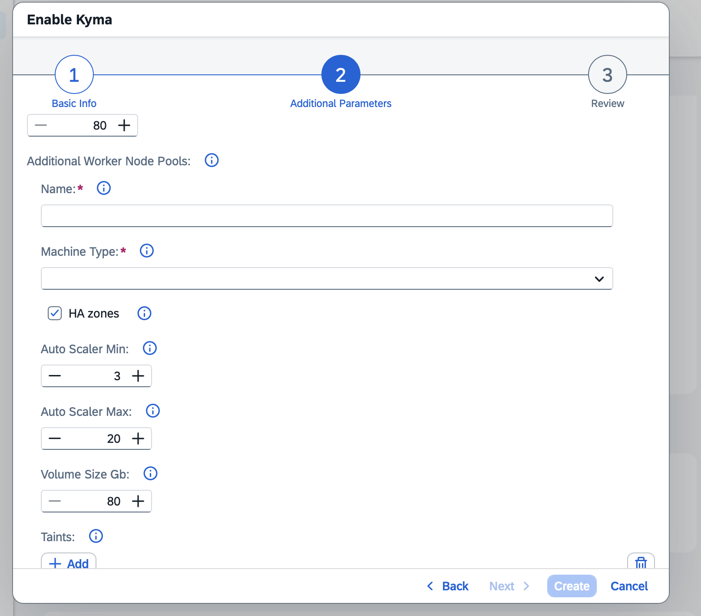
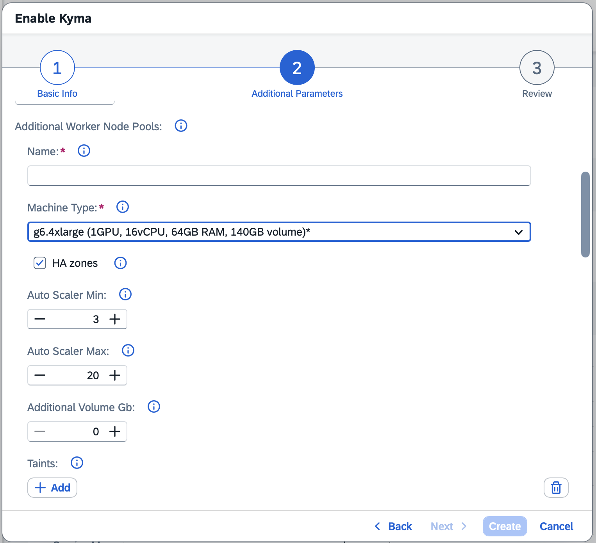

# Configurable Node Volume Size

## Contents

- [Status](#status)
- [Context](#context)
  - [Current State](#current-state)
- [Approach 1: Static `volumeSizeGb` per Worker Pool](#approach-1-static-volumesizegb-per-worker-pool)
- [Approach 2: Dynamic Volume Based on Machine Type + `additionalVolumeGb`](#approach-2-dynamic-volume-based-on-machine-type--additionalvolumegb)
- [Decision](#decision)
- [Implementation](#implementation)
  - [Sub-approach 1: New ConfigMap](#sub-approach-1-new-configmap)
    - [Option A: Static ConfigMap defined in values.yaml](#option-a-static-configmap-defined-in-valuesyaml)
    - [Option B: Chart defines an empty ConfigMap, KEB populates it at startup](#option-b-chart-defines-an-empty-configmap-keb-populates-it-at-startup)
    - [Option C: Use the existing ConfigMap owned by KCR](#option-c-use-the-existing-configmap-owned-by-kcr)
  - [Sub-approach 2: Extend the RuntimeCR](#sub-approach-2-extend-the-runtimecr)
- [Implementation Decision](#implementation-decision)
- [Migration of Existing Clusters](#migration-of-existing-clusters)
  - [Option A: Cloud Orchestrator](#option-a-cloud-orchestrator)
  - [Option B: Agnostic machine name cutover](#option-b-agnostic-machine-name-cutover)
- [Machine Type Volume Size Reference](#machine-type-volume-size-reference)
- [Summary](#summary)

## Status

Accepted

## Context

If the disk (volume) attached to Kubernetes worker nodes fills up, it can render the node unusable and cause workload disruptions.

Users running large machine types with many Pods can encounter disk-full conditions because the current default volume size (80 GiB) is insufficient for high-density nodes. Today, **volumeSizeGb** is an internal KEB setting per plan, and users cannot configure it.

### Current State

- **volumeSizeGb** is defined per plan in the KEB plans configuration.
- The value is not exposed to users, neither for the main worker pool nor for additional worker pools.
- `sap-converged-cloud` does not set any volume configuration.

## Approach 1: Static volumeSizeGb per Worker Pool

There are two variants for what we could expose to the user:

- Variant A: Expose **volumeSizeGb** directly - the user sets the total volume size. The schema shows the default and minimum (equal to the plan default). Users see and manage the full size. When the parameter is not provided in the payload, the plan default is applied for backward compatibility.

- Variant B: Expose only **additionalVolumeGb** - the user sets only the extra GB on top of the plan default. The input defaults to 0. The plan default base is transparent to the user and always included for free. The input directly represents what the user pays for.

The screenshots below show Variant A. For Variant B, the UI looks almost the same, but the default value would be 0, and the label would be **Additional Volume GB**.

BTP cockpit - main Kyma worker pool:


BTP cockpit - additional worker node pool:



**Provisioning request example:**
```json
{
  "parameters": {
    "name": "my-cluster",
    "machineType": "m6i.4xlarge",
    "volumeSizeGb": 150,
    "additionalWorkerNodePools": [
      {
        "name": "gpu-pool",
        "machineType": "g4dn.8xlarge",
        "volumeSizeGb": 200,
        "autoScalerMin": 1,
        "autoScalerMax": 3
      }
    ]
  }
}
```

The schema declares `minimum` and `maximum` constraints as static values. The default and minimum are shown in the BTP cockpit.

### Billing

- The plan default volume size is included in the base machine price with no additional charge.
- Any **volumeSizeGb** value above the plan default is charged.
- The volume size is available as a status attribute on the Kubernetes node API, so the actual disk size per node can be detected at runtime for billing purposes.
- The price calculator must be updated to include the **volumeSizeGb** input field showing the additional cost when the value exceeds the default.

### Pros

- Simple to implement and maintain.
- Users pay extra only for GB above the plan default.
- No calculations of the volume size per machine are needed.
- KEB operators need to refresh ERS only once when this feature is rolled out or when the default value is changed.

### Cons

- TBD

## Approach 2: Dynamic Volume Based on Machine Type and additionalVolumeGb

KEB computes the volume size automatically based on the selected machine type. The computed size is included in the base machine price at no extra cost. Users can additionally request extra GB on top using an optional **additionalVolumeGb** parameter, which is billed separately per GB above the computed base.

The dynamic volume size can be obtained using one of two sub-options for the calculation:

- Sub-option A: Configurable mapping table maps machine size ranges (for example, by vCPU count) to fixed volume sizes. Easier to reason about, but requires maintaining the table as new machine types are added.

- Sub-option B: Formula computes the volume size from the machine's resources:

    

Where the formula values come from:

| Value | Source |
|-------|--------|
| **volume_base** | Configurable base amount per landscape |
| **vCPUs** | Machine type metadata from the provider (for example, 32 vCPUs for `m6i.8xlarge`) |
| **memory_GiB** | Machine type metadata from the provider (for example, 128 GiB for `m6i.8xlarge`) |
| **volume_factor** | Normalized resource multiplier for total volume size set per landscape |

See an example producing 148 GiB for a 32 vCPU / 128 GiB RAM machine (for example, `m6i.8xlarge`) on a GardenLinux landscape (`volume_base=20`, `volume_factor=8`):

```
volume_size = 20 + max(32/2, 128/8) * 8
           = 20 + max(16, 16) * 8
           = 20 + 16 * 8
           = 20 + 128
           = 148 GiB
```

The computed volume size is shown alongside vCPU and memory in the machine type display name in the BTP cockpit, for example, `m6i.8xlarge (32 vCPU, 128 GiB RAM, 148 GiB volume)`.

BTP cockpit - main worker pool:


BTP cockpit - additional worker node pool:



Provisioning request example:
```json
{
  "parameters": {
    "name": "my-cluster",
    "machineType": "m6i.4xlarge",
    "additionalVolumeGb": 50,
    "additionalWorkerNodePools": [
      {
        "name": "gpu-pool",
        "machineType": "g4dn.8xlarge",
        "additionalVolumeGb": 100,
        "autoScalerMin": 1,
        "autoScalerMax": 3
      }
    ]
  }
}
```

### Billing

- The computed base volume size is included in the base machine price at no extra cost.
- Only the **additionalVolumeGb** amount is charged, per GB, per node, per month.
- The volume size is available as a status attribute on the Kubernetes node API, so the actual disk size per node can be detected at runtime for billing purposes.
- The price calculator must be updated to include an **additionalVolumeGb** input field showing the additional cost.

### Pros

- Large machines automatically get a larger disk without any user action.
- Users pay extra only for GB above the machine type default.

### Cons

- More complex to implement.
- Different formula parameters may be needed per OS image (GardenLinux vs. Ubuntu Pro).
- Users may not notice that the volume size differs per machine type.
- Every formula change requires KEB operators to be notified and ERS to be refreshed.
- There is a risk of temporarily inconsistent disk sizes displayed in the BTP cockpit if KEB already uses a different size for a given machine, since ERS refresh takes time.


## Decision

Approach 2 is chosen.

## Implementation

Two sub-approaches are considered for how the computed volume size is stored and shared between KEB and Kyma Consumption Reporter (KCR).

### Sub-Approach 1: New ConfigMap

A dedicated ConfigMap stores machine type characteristics and the computed default disk size for each machine type. KCR reads the ConfigMap to look up the default disk size for a given machine type and uses it to calculate the billable additional size set by the user.

Two options are considered for how the ConfigMap is populated.

#### Option A: Static ConfigMap Defined in `values.yaml`

The machine characteristics are defined in `values.yaml` in a structured, nested format. A new section **machineCharacteristics** (name to be discussed) lists every supported machine type with its properties as nested keys:

```yaml
# values.yaml
machineCharacteristics:
  m6i.4xlarge:
    cpu: 16
    ram: 64
    gpu: 0
    nodeSize: 80
  m6i.8xlarge:
    cpu: 32
    ram: 128
    gpu: 0
    nodeSize: 148
```

A Helm template iterates over this structure and renders a flat ConfigMap, using a `machineName_field` key naming convention:

```yaml
apiVersion: v1
kind: ConfigMap
metadata:
  name: keb-machine-characteristics
data:
  {{- range $machine, $props := .Values.machineCharacteristics }}
  {{ $machine }}_cpu: {{ $props.cpu | quote }}
  {{ $machine }}_ram: {{ $props.ram | quote }}
  {{ $machine }}_gpu: {{ $props.gpu | quote }}
  {{ $machine }}_nodeSize: {{ $props.nodeSize | quote }}
  {{- end }}
```

Which produces:

```yaml
data:
  m6i.4xlarge_cpu: "16"
  m6i.4xlarge_ram: "64"
  m6i.4xlarge_gpu: "0"
  m6i.4xlarge_nodeSize: "80"
  m6i.8xlarge_cpu: "32"
  m6i.8xlarge_ram: "128"
  m6i.8xlarge_gpu: "0"
  m6i.8xlarge_nodeSize: "148"
```

As an alternative to flat keys, the ConfigMap could store the entire structure as an embedded YAML string under a single key.

```yaml
data:
  machineCharacteristics: |
    m6i.4xlarge:
      cpu: 16
      ram: 64
      gpu: 0
      nodeSize: 80
    m6i.8xlarge:
      cpu: 32
      ram: 128
      gpu: 0
      nodeSize: 148
```

**Pros:**
- Content is fully declarative in the chart.
- ArgoCD manages the ConfigMap like any other chart resource.
- No runtime logic needed to populate the ConfigMap.
- Backward compatible.
- No action required for external operators. We can define those values for every machine type in our config.
- More details available for KCR.

**Cons:**
- Some machine type data is duplicated in `values.yaml`.
- `values.yaml` length will grow significantly.

#### Option B: Chart Defines an Empty ConfigMap, KEB Populates It at Startup

The Helm chart defines the ConfigMap with no data entries. When KEB starts, it reads the existing machine type definitions from **providersConfig**, applies the volume size formula for each machine type, and writes the results into the ConfigMap. The final structure of the keys in the ConfigMap is identical to Option A.

As an alternative to running the formula, KEB could extract the node size directly from the existing enum display name (for example, `m6i.8xlarge (32 vCPU, 128 GiB RAM, 148 GiB volume)`). The volume value would be embedded in the display name. However, this would also require the operators to update the display name, as it currently does not include the volume size.

**Pros:**
- Machine type data has a single source of truth: the existing **providersConfig** in KEB.
- New machine types are picked up automatically.
- More details available for KCR.

**Cons:**
- There is a gap between KEB startup and the moment the ConfigMap is fully populated.
- Should KEB watch this ConfigMap and reconcile it, or is a new job required?
- If Argo CD manages the ConfigMap and detects drift between the chart definition (empty) and the live state (populated by KEB), it may revert the ConfigMap to the empty state on the next sync. This would require annotating the ConfigMap with `argocd.argoproj.io/compare-options: IgnoreExtraneous` (see [Argo CD compare options](https://argo-cd.readthedocs.io/en/stable/user-guide/compare-options/)).
- Most complex solution to implement.

#### Option C: Use the Existing ConfigMap Owned by KCR

Instead of creating a new ConfigMap, KEB reads the default volume sizes from the existing ConfigMap managed by KCR.

The ConfigMap already contains all supported machine types. The default volume size values for each machine type are manually pre-calculated (using the formula `clamp(volume_base + max(vCPUs / 2, memory_GiB / 8) * volume_factor, min=80, max=250)` as a reference) and declared in KCR's `values.yaml`, which is used to build the ConfigMap.

**How KEB uses the ConfigMap:**
- If a machine type is present in the ConfigMap, KEB uses the value from the map as the default volume size and ignores the plan default.
- If a machine type is not present in the ConfigMap, or is present but its disk size entry is missing, KEB fails the operation.
- The volume size read from the ConfigMap is appended to the machine type display name shown in the BTP cockpit (for example, `m6i.8xlarge (32 vCPU, 128 GiB RAM, 148 GiB volume)`). If the existing display name does not follow the bracket format (for example, `test 80gb disk`), a consistent insertion strategy must be defined.

**Startup and validation behaviour:**

**kcrConfigMapEnabled** (default: `false`) — when `false`, KEB ignores the ConfigMap entirely and always uses the plan default. When `true`, KEB panics at startup if any of the following conditions are met:

- The ConfigMap itself is missing.
- A machine type supported by KEB is missing from the ConfigMap.
- A machine type supported by KEB is present in the ConfigMap but its `default volume size` entry is missing.

Any provisioning or update request where the machine type or its disk size is not found in the ConfigMap also fails immediately.

- On each provisioning or update request that changes the machine type, KEB looks up the machine type in the ConfigMap. If the machine type is not found, or is found but its disk size entry is missing, KEB fails the operation.
- The KCR ConfigMap may contain machine types that KEB does not use. However, every machine type that KEB supports must be present in the ConfigMap with a valid `default volume size` value when **kcrConfigMapEnabled** is `true`.

**Pros:**
- Single source of truth shared by KEB and KCR.
- KEB does not need to create or manage any new ConfigMap.
- Operators on restricted markets do not need to make any changes on the KEB side.

**Cons:**
- KEB has a new dependency on KCR.

**Deployment plan:**
1. KCR extends their ConfigMap to include the default volume size for every supported machine type. From this point, KCR begins using the new default values in its billing calculations. During the transition period, before KEB starts provisioning clusters with the new default sizes, some existing clusters will have an actual disk size smaller than the new default (for example, 80 GiB on disk versus a new default of 148 GiB). This means KCR may observe that a cluster has less volume than the default defined in the ConfigMap. This behaviour is expected, as existing clusters must migrate to the new default volume size.
2. Once KCR has confirmed that all machine types used by KEB are present in the ConfigMap, KEB is deployed with `kcrConfigMapEnabled: true`. From this point, KEB panics at startup if the ConfigMap is missing, and provisioning or update operations that request a machine type not present in the ConfigMap, or whose disk size entry is missing, are failed immediately.


### Sub-Approach 2: Extend the RuntimeCR

The existing RuntimeCR is extended with a new field that stores the **additionalVolumeGb** for the main worker pool and each additional worker pool. The field is optional. If not present, it is interpreted as 0 (no additional volume set). The field is purely informational and must not be propagated to the RuntimeCR; it is used by KCR solely for billing purposes.

The **additionalVolumeGb** field is placed inside the existing `volume` object. The **volume.size** field reflects the total disk size, which is the sum of the default size and **additionalVolumeGb**.

```json
"volume": {
  "size": "100Gi",
  "type": "StandardSSD_LRS",
  "additionalVolumeGb": 20
}
```

In this example, the default size is 80 GiB, and the user requested 20 GiB of additional volume, so **volume.size** is set to `100 GiB`. KEB is responsible for computing this sum.

**Pros:**
- Uses the already existing RuntimeCR.
- Easier to implement and maintain. From the perspective of external KCP operators, nothing changes as no new resources are introduced.
- KCR already watches the RuntimeCR.

**Cons:**
- The RuntimeCR CRD must be extended.
- 3 teams involved in implementation.
- Less information available for KCR.

## Implementation Decision

Sub-approach 1, Option C (use the existing ConfigMap owned by KCR) is chosen: KEB reads the default volume sizes from the existing ConfigMap owned by KCR. No new ConfigMap is introduced. KCR extends their ConfigMap with the **default disk size** field per machine type, and KEB reads that value at provisioning and update time.

## Migration of Existing Clusters

Changing **volumeSizeGb** in a worker pool spec in the RuntimeCR triggers a Gardener rolling update. New clusters provisioned after this feature is enabled will automatically receive the correct computed volume size. For existing clusters, the current volume size is already set in the RuntimeCR.

The problem is that if KEB automatically applies the new computed volume size during any update operation, users will receive a rolling update without being aware that the disk size changed. A controlled migration mechanism is therefore needed.

### Option A: Cloud Orchestrator

The migration is executed in four ordered steps:

0. SRE checks for outliers and adjusts the formula if needed. SRE checks for any Kyma instances with a node volume size other than the default configuration and adjusts the formula so the detected outliers are not shrunk.
1. KCR adds default disk sizes to the ConfigMap. KCR extends their ConfigMap with the **default disk size** entry for every supported machine type.
2. KEB deploys with `kcrConfigMapEnabled: true`. From this point, all newly provisioned clusters and worker pools receive the new computed default volume size. Update operations that change the machine type also apply the new volume size. Update operations that do not change the machine type, such as autoscaler adjustments, leave the existing volume size unchanged. Steps 2 and 3 are coordinated and executed together. KEB is deployed with `kcrConfigMapEnabled: true` immediately before Cloud Orchestrator is started.
3. SRE updates existing RuntimeCRs using Cloud Orchestrator. SRE runs Cloud Orchestrator, which applies the new computed volume size to the main and additional worker pool spec of every remaining RuntimeCR.
4. KEB exposes `additionalVolumeGb` configuration. After all existing clusters have been updated to the new default volume size, KEB enables a second feature flag that exposes the **additionalVolumeGb** parameter to users.

**Pros:**
- No user action required.
- Clean cutoff from the old default size.
- All users immediately receive the new, larger free default volume size.

**Cons:**
- User communication may be needed.
- SRE involvement is required.
- A maintenance window may be needed to roll out this change.
- External KCP operators have additional work to do.
- KEB needs a second feature flag for exposing the new parameter.

### Option B: Agnostic Machine Name Cutover

ADR-002 introduces version-agnostic machine names (e.g. `mi.8xlarge`) alongside the deprecated concrete names (e.g. `m6i.8xlarge`). This boundary can be used as a natural migration point: KEB applies the computed volume size only to clusters using agnostic machine names. Clusters still using deprecated concrete names keep the old plan default volume size and are not affected.

As users migrate their clusters to agnostic machine names they automatically receive the correct volume size. No proactive rolling update is triggered. The volume size migration happens alongside the machine name migration.

**Pros:**
- No surprise rolling updates for existing clusters.
- No migration tooling or SRE action required.
- No external operators action required.

**Cons:**
- Clusters that never migrate to agnostic names keep the old volume size indefinitely.
- The feature is only fully deployed once all clusters have moved to agnostic machine names.
- Agnostic machine name feature must be released

**Billing edge cases:**

Three scenarios arise when `additionalVolumeGb` interacts with deprecated machine names:

- **Old machine + additionalVolumeGb where the sum is below the new computed default.** For example, a user on `m6i.8xlarge` (old default: 80 GiB) sets `additionalVolumeGb: 20`, resulting in a 100 GiB disk. The new computed default for that machine would be 148 GiB. The user is currently billed for 20 GiB that would be provided for free under the new default.

- **User migrates from deprecated to agnostic machine name while additionalVolumeGb is set.** For example, the user migrates from `m6i.8xlarge` to `mi.8xlarge`. The new computed default jumps from 80 GiB to 148 GiB. The user had `additionalVolumeGb: 20`, so the total would become 168 GiB — larger than what the user originally intended, and the 20 GiB may now overlap with the free portion of the new default.

- **Block additionalVolumeGb for deprecated machine names.** KEB rejects any provisioning or update request that sets `additionalVolumeGb` while using a deprecated concrete machine name. Users who want to set additional volume must first migrate to an agnostic machine name. This enforces a clean separation. Deprecated names always use the old plan default, agnostic names always use the computed default with optional additional.

## Machine Type Volume Size Reference

Computed volume sizes for all supported machine types using the formula with `volume_base=20`, `volume_factor=8`, capped at a minimum of **80 GiB** and a maximum of **250 GiB**:

`clamp(20 + max(vCPUs / 2, RAM_GiB / 8) * 8, min=80, max=250)`

### AWS

| Machine Type | vCPU | RAM (GiB) | Raw (GiB) | Volume Size (GiB) |
|---|---|---|---|---|
| m6i.large | 2 | 8 | 28 | 80 *(min cap)* |
| m6i.xlarge | 4 | 16 | 36 | 80 *(min cap)* |
| m6i.2xlarge | 8 | 32 | 52 | 80 *(min cap)* |
| m6i.4xlarge | 16 | 64 | 84 | **84** |
| m6i.8xlarge | 32 | 128 | 148 | **148** |
| m6i.12xlarge | 48 | 192 | 212 | **212** |
| m6i.16xlarge | 64 | 256 | 276 | 250 *(max cap)* |
| m5.large | 2 | 8 | 28 | 80 *(min cap)* |
| m5.xlarge | 4 | 16 | 36 | 80 *(min cap)* |
| m5.2xlarge | 8 | 32 | 52 | 80 *(min cap)* |
| m5.4xlarge | 16 | 64 | 84 | **84** |
| m5.8xlarge | 32 | 128 | 148 | **148** |
| m5.12xlarge | 48 | 192 | 212 | **212** |
| m5.16xlarge | 64 | 256 | 276 | 250 *(max cap)* |
| c7i.large | 2 | 4 | 28 | 80 *(min cap)* |
| c7i.xlarge | 4 | 8 | 36 | 80 *(min cap)* |
| c7i.2xlarge | 8 | 16 | 52 | 80 *(min cap)* |
| c7i.4xlarge | 16 | 32 | 84 | **84** |
| c7i.8xlarge | 32 | 64 | 148 | **148** |
| c7i.12xlarge | 48 | 96 | 212 | **212** |
| c7i.16xlarge | 64 | 128 | 276 | 250 *(max cap)* |
| g6.xlarge | 4 | 16 | 36 | 80 *(min cap)* |
| g6.2xlarge | 8 | 32 | 52 | 80 *(min cap)* |
| g6.4xlarge | 16 | 64 | 84 | **84** |
| g6.8xlarge | 32 | 128 | 148 | **148** |
| g6.12xlarge | 48 | 192 | 212 | **212** |
| g6.16xlarge | 64 | 256 | 276 | 250 *(max cap)* |
| g4dn.xlarge | 4 | 16 | 36 | 80 *(min cap)* |
| g4dn.2xlarge | 8 | 32 | 52 | 80 *(min cap)* |
| g4dn.4xlarge | 16 | 64 | 84 | **84** |
| g4dn.8xlarge | 32 | 128 | 148 | **148** |
| g4dn.12xlarge | 48 | 192 | 212 | **212** |
| g4dn.16xlarge | 64 | 256 | 276 | 250 *(max cap)* |

### Azure

| Machine Type | vCPU | RAM (GiB) | Raw (GiB) | Volume Size (GiB) |
|---|---|---|---|---|
| Standard_D2s_v5 | 2 | 8 | 28 | 80 *(min cap)* |
| Standard_D4s_v5 | 4 | 16 | 36 | 80 *(min cap)* |
| Standard_D8s_v5 | 8 | 32 | 52 | 80 *(min cap)* |
| Standard_D16s_v5 | 16 | 64 | 84 | **84** |
| Standard_D32s_v5 | 32 | 128 | 148 | **148** |
| Standard_D48s_v5 | 48 | 192 | 212 | **212** |
| Standard_D64s_v5 | 64 | 256 | 276 | 250 *(max cap)* |
| Standard_D4_v3 | 4 | 16 | 36 | 80 *(min cap)* |
| Standard_D8_v3 | 8 | 32 | 52 | 80 *(min cap)* |
| Standard_D16_v3 | 16 | 64 | 84 | **84** |
| Standard_D32_v3 | 32 | 128 | 148 | **148** |
| Standard_D48_v3 | 48 | 192 | 212 | **212** |
| Standard_D64_v3 | 64 | 256 | 276 | 250 *(max cap)* |
| Standard_F2s_v2 | 2 | 4 | 28 | 80 *(min cap)* |
| Standard_F4s_v2 | 4 | 8 | 36 | 80 *(min cap)* |
| Standard_F8s_v2 | 8 | 16 | 52 | 80 *(min cap)* |
| Standard_F16s_v2 | 16 | 32 | 84 | **84** |
| Standard_F32s_v2 | 32 | 64 | 148 | **148** |
| Standard_F48s_v2 | 48 | 96 | 212 | **212** |
| Standard_F64s_v2 | 64 | 128 | 276 | 250 *(max cap)* |
| Standard_NC4as_T4_v3 | 4 | 28 | 48 | 80 *(min cap)* |
| Standard_NC8as_T4_v3 | 8 | 56 | 76 | 80 *(min cap)* |
| Standard_NC16as_T4_v3 | 16 | 110 | 130 | **130** |
| Standard_NC64as_T4_v3 | 64 | 440 | 460 | 250 *(max cap)* |

### GCP

| Machine Type | vCPU | RAM (GiB) | Raw (GiB) | Volume Size (GiB) |
|---|---|---|---|---|
| n2-standard-2 | 2 | 8 | 28 | 80 *(min cap)* |
| n2-standard-4 | 4 | 16 | 36 | 80 *(min cap)* |
| n2-standard-8 | 8 | 32 | 52 | 80 *(min cap)* |
| n2-standard-16 | 16 | 64 | 84 | **84** |
| n2-standard-32 | 32 | 128 | 148 | **148** |
| n2-standard-48 | 48 | 192 | 212 | **212** |
| n2-standard-64 | 64 | 256 | 276 | 250 *(max cap)* |
| c2d-highcpu-2 | 2 | 4 | 28 | 80 *(min cap)* |
| c2d-highcpu-4 | 4 | 8 | 36 | 80 *(min cap)* |
| c2d-highcpu-8 | 8 | 16 | 52 | 80 *(min cap)* |
| c2d-highcpu-16 | 16 | 32 | 84 | **84** |
| c2d-highcpu-32 | 32 | 64 | 148 | **148** |
| c2d-highcpu-56 | 56 | 112 | 244 | **244** |
| g2-standard-4 | 4 | 16 | 36 | 80 *(min cap)* |
| g2-standard-8 | 8 | 32 | 52 | 80 *(min cap)* |
| g2-standard-12 | 12 | 48 | 68 | 80 *(min cap)* |
| g2-standard-16 | 16 | 64 | 84 | **84** |
| g2-standard-24 | 24 | 96 | 116 | **116** |
| g2-standard-32 | 32 | 128 | 148 | **148** |
| g2-standard-48 | 48 | 192 | 212 | **212** |

### Alicloud

| Machine Type | vCPU | RAM (GiB) | Raw (GiB) | Volume Size (GiB) |
|---|---|---|---|---|
| ecs.g8i.large | 2 | 8 | 28 | 80 *(min cap)* |


## Summary

We chose Approach 2 (dynamic volume size based on machine type) with Sub-approach 1, Option C (use the existing ConfigMap owned by KCR) for the implementation, and Option A (Cloud Orchestrator) for migrating existing clusters.

The volume size is computed per machine type using the formula `volume_base + max(vCPUs / 2, RAM_GiB / 8) * volume_factor`, capped between 80 GiB and 250 GiB. This size is provided free of charge as part of the base machine price. Users can request additional storage on top using an optional **additionalVolumeGb** parameter, which is billed separately.

KEB reads the default volume sizes from the existing ConfigMap owned by KCR. KCR extends that ConfigMap with a **default disk size** field per machine type. KEB is deployed with a `kcrConfigMapEnabled` flag; when enabled, it panics at startup if the ConfigMap is missing or incomplete.

Existing clusters are migrated using Cloud Orchestrator. Once KCR has populated the ConfigMap and KEB is deployed with `kcrConfigMapEnabled: true`, SRE runs Cloud Orchestrator to apply the new computed volume sizes to all existing RuntimeCRs. The **additionalVolumeGb** parameter is only exposed to users after all clusters have been updated to the new default.
